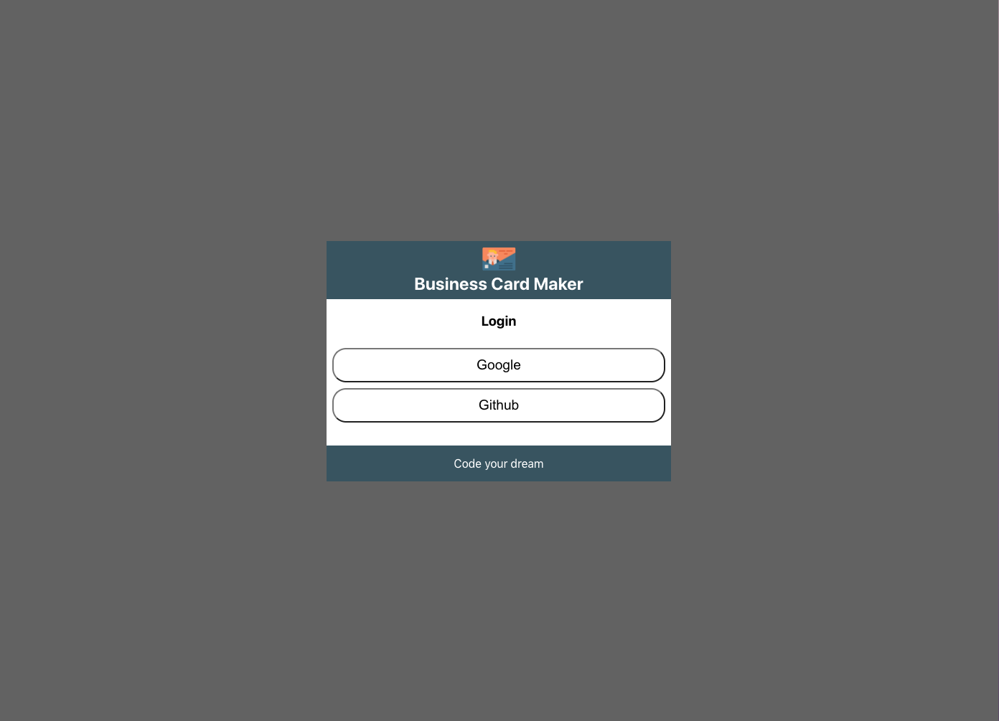
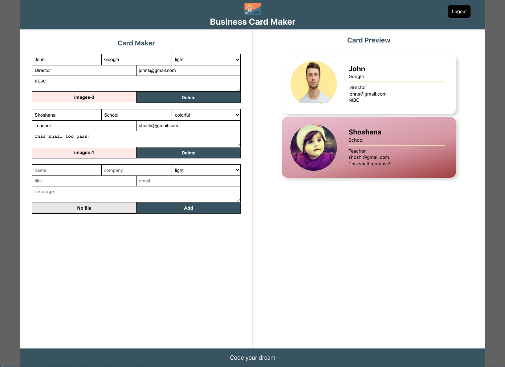

## Project name

Card Maker

## Summary

The main page consists of two sides as editor and preview. If the user edit information on the editor side, changes are applied in the preview side in real-time therefore the user can make the card easily in their own style.
This project was bootstrapped with [Create React App](https://github.com/facebook/create-react-app).


## Stack

React, PostCss, React Router, FireBase(Authentication, Realtime Database), Cloudinary

## Main Function

- It consists of two pages - Login page and Edit/Preview page after authentication
- In Edit/Preview page, user can edit the business card in edit side and see the update in preview realtime, and data are saved in firebase.
- Profile pictures are uploaded in consistent format to cloudinary server.

LoginPage  
  
Edit/Preview  


## Folder Structure

```
Card Maker - react
├── public/          #static files
│   └── index.html   #html
│
├── src/             #project root
│   ├── common/
│   │      └── colors, size.css   #Root CSS
│   │
│   ├── components/      #components - reusable components source
|   │   ├── button.jsx+css
|   │   ├── card.jsx+css
|   │   ├── card_add_form.jsx+css
|   │   ├── card_edit_form.jsx+css
|   │   ├── editor.jsx+css
|   │   ├── footer.jsx+css
|   │   ├── header.jsx+css
|   │   ├── image_file_input.jsx+css
|   │   ├── login.jsx+css
|   │   ├── maker.jsx+css
|   │   └── preview.jsx+css
|   │
│   ├── service/
|   │   ├── auth_service.js
|   │   ├── card_repository.js
|   │   ├── firebase.js
|   │   └── image_uploader.js
|   │
│   ├── app.jsx
│   ├── app.module.css
│   ├── index.js
│   └── index.module.css
│
└── package.json
```

## Component Structure

```
Initial Page
      ├── Header
      ├── Login authService
      └── Footer

Main Page
    ├── Maker
    |     ├── Editor
    |     ├── CardEditForm
    |     ├── FileInput
    |     ├── Button
    |     |
    |     ├── CardAddForm
    |     ├── FileInput
    |     └── Button
    └── Preview
          └── Card
```
